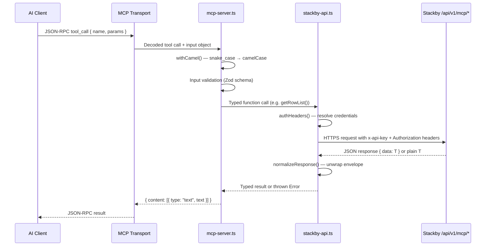
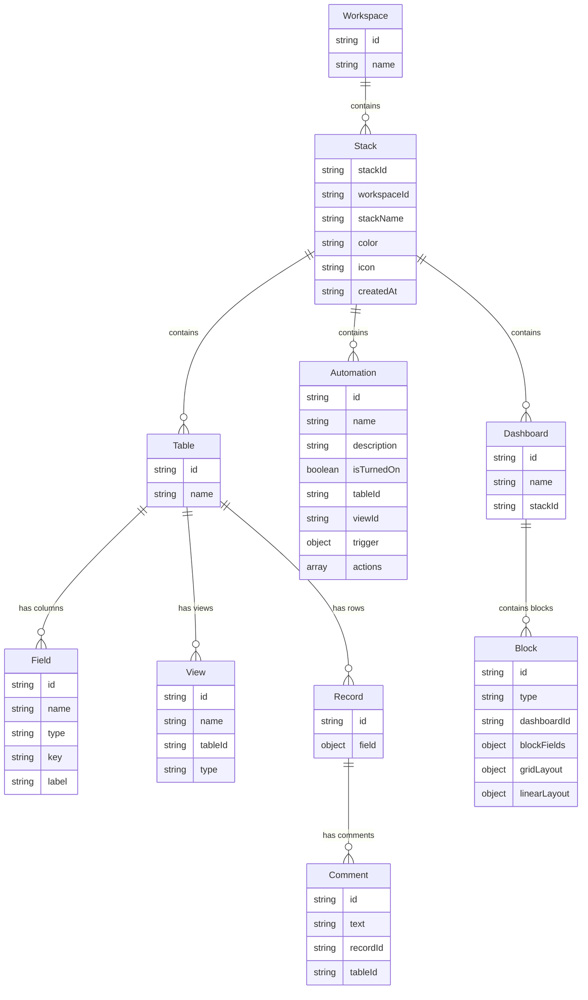
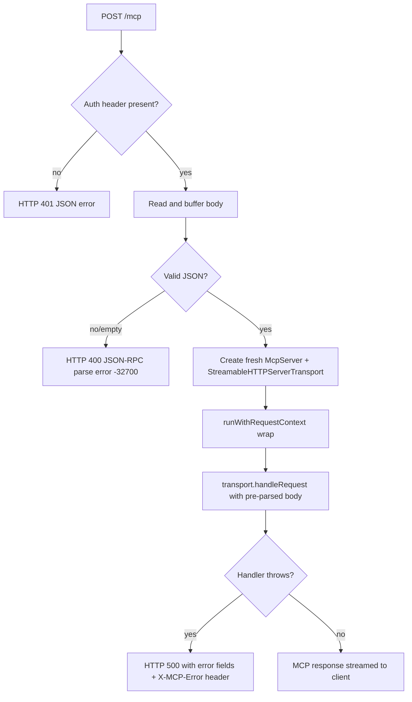
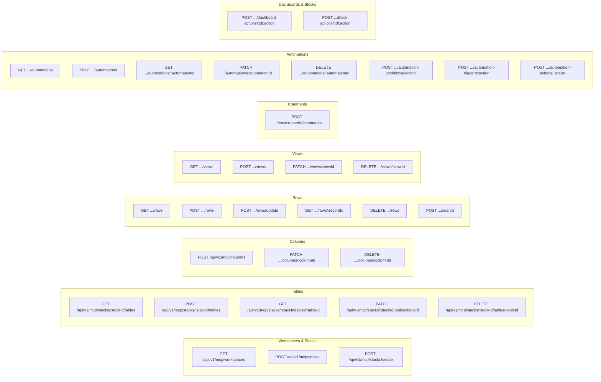
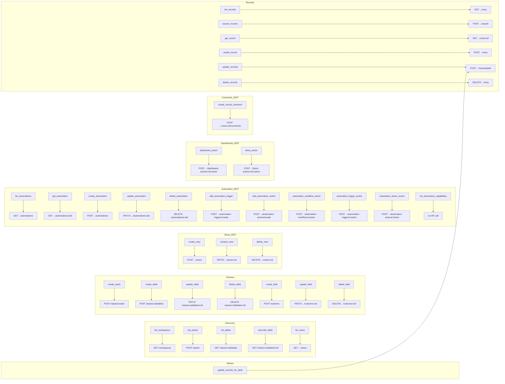
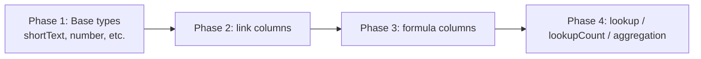

# Design Document: Stackby MCP Server Documentation

## Overview

This document describes the technical design for producing comprehensive documentation for the Stackby MCP Server. The documentation covers the project architecture, all 36 MCP tools, the full Stackby API layer, authentication model, request lifecycle, and deployment configuration. The documentation is targeted at three audiences: developers integrating with the MCP server, Stackby platform engineers maintaining the backend, and AI/LLM tool builders extending the system.

### Documentation Deliverables

The design produces a single structured documentation tree at `docs/` within the repository:

```
docs/
├── index.md                   # Project overview and quick start
├── architecture.md            # System architecture and component descriptions
├── authentication.md          # Credential model, request context, auth flow
├── http-server.md             # HTTP routes, error handling, OAuth proxy
├── api-reference.md           # All /api/v1/mcp/* backend endpoints
├── tools/
│   ├── README.md              # Tool catalog overview and conventions
│   ├── read-operations.md     # list_workspaces, list_stacks, list_tables, etc.
│   ├── write-operations.md    # create_record, update_records, delete_records, etc.
│   ├── schema-management.md   # create_table, create_field, update_field, etc.
│   ├── view-management.md     # create_view, rename_view, delete_view
│   ├── stack-creation.md      # create_stack, template system
│   ├── automation.md          # create_automation, add_automation_trigger, etc.
│   └── dashboard-blocks.md    # dashboard_action, block_action
├── data-model.md              # Stackby entity model
├── request-lifecycle.md       # End-to-end flow, camelCase normalization, error chain
├── deployment.md              # Env vars, Cursor config, Claude Desktop config, Docker
└── troubleshooting.md         # Common failure modes and fixes
```

Each file is authored in standard GitHub-flavored Markdown. No build step or static site generator is required; the files render correctly in GitHub, npm, and any Markdown viewer. Each section maps directly to one or more requirements from the requirements document.

---

## Architecture

### System Architecture Overview

The Stackby MCP Server is a Node.js/TypeScript application with two transport entry points that share a single core — a registered set of MCP tools — and a single HTTP API client layer.

```mermaid
graph TB
    subgraph AI Clients
        A1[Cursor]
        A2[Claude Desktop]
        A3[ChatGPT / Hosted]
        A4[Cline / other MCP clients]
    end

    subgraph MCP Server Process
        T1[stdio transport<br/>src/index.ts]
        T2[StreamableHTTP transport<br/>src/server-http.ts]
        MC[MCP Tool Handlers<br/>src/mcp-server.ts]
        RC[Request Context<br/>src/request-context.ts]
        API[Stackby API Client<br/>src/stackby-api.ts]
        ST[Stack Template<br/>src/stack-template.ts]
        BAS[Block App Specs<br/>src/block-app-specs.ts]
    end

    subgraph Stackby Backend
        BE[/api/v1/mcp/* REST Endpoints<br/>v1/app.js]
    end

    A1 -->|stdio JSON-RPC| T1
    A2 -->|stdio JSON-RPC| T1
    A3 -->|HTTP POST /mcp| T2
    A4 -->|stdio or HTTP| T1

    T1 --> MC
    T2 --> MC
    T2 --> RC

    MC --> API
    MC --> ST
    MC --> BAS
    ST --> API
    RC -.->|per-request creds| API

    API -->|HTTPS REST| BE
```

### Entry Points

| Entry Point | File | Transport | Supported Clients |
|---|---|---|---|
| stdio | `src/index.ts` | `StdioServerTransport` | Cursor, Claude Desktop, Cline |
| HTTP | `src/server-http.ts` | `StreamableHTTPServerTransport` | ChatGPT, any HTTP MCP client, hosted at `mcp.stackby.com` |

The stdio entry point creates a single long-lived `McpServer` connected to a single `StdioServerTransport`. The HTTP entry point creates a **fresh** `McpServer` and `StreamableHTTPServerTransport` for every incoming POST request, making it fully stateless with no shared state between requests.

### Source File Responsibilities

| File | Responsibility |
|---|---|
| `src/index.ts` | stdio entry point; creates the MCP server and connects it to a `StdioServerTransport`. |
| `src/server-http.ts` | HTTP entry point; Node.js HTTP server handling `/mcp`, `/health`, and OAuth proxy routes; creates a fresh `McpServer` per request. |
| `src/mcp-server.ts` | Core factory; registers all 36 MCP tools with their Zod input schemas and handler functions. |
| `src/stackby-api.ts` | Stackby HTTP API client; all functions that call `/api/v1/mcp/*` endpoints; handles auth headers and response normalization. |
| `src/request-context.ts` | `AsyncLocalStorage`-based per-request context; stores API key, bearer token, and API URL for the duration of one HTTP request. |
| `src/stack-template.ts` | Client-side stack template applicator; orchestrates multi-step table/column/row creation from a declarative template definition. |
| `src/block-app-specs.ts` | Registry of block type aliases; resolves user-supplied block type strings to canonical Stackby block types. |

### Build System

TypeScript is compiled with `tsc` (TypeScript 5.3+, configured via `tsconfig.json`) to `dist/`. The project uses ESM modules (`"type": "module"` in `package.json`).

```
npm run build    # tsc → dist/
npm start        # node dist/index.js  (stdio)
npm run start:http  # node dist/server-http.js  (HTTP)
```

Runtime dependencies: `@modelcontextprotocol/sdk ^1.0.0`, `zod ^3.23.0`. Minimum Node.js: `>=18`.

---

## Components and Interfaces

### Component Interaction: Layer-by-Layer



### Authentication Interface

The `RequestContext` interface is the bridge between the HTTP transport and the API client:

```typescript
interface RequestContext {
  apiKey?: string;       // from X-Stackby-API-Key header
  bearerToken?: string;  // from Authorization: Bearer header
  apiUrl?: string;       // from X-Stackby-API-URL header
}
```

In stdio mode, credentials come from `process.env.STACKBY_API_KEY` and `process.env.STACKBY_BEARER_TOKEN`. In HTTP mode, the `runWithRequestContext()` wrapper stores them in `AsyncLocalStorage` for the duration of one request, and `getApiKeyFromContext()` / `getBearerTokenFromContext()` retrieve them.

### MCP Tool Registration Interface

All tools are registered via `mcpServer.registerTool(name, { description, inputSchema }, handler)`. The `inputSchema` uses Zod schemas. The `withCamel()` wrapper normalizes all input keys before the handler runs:

```typescript
function withCamel<R>(
  handler: (input: Record<string, any>) => Promise<R>
): (input: any) => Promise<R>
```

### Tool Response Interface

Every tool returns a `{ content: [{ type: "text", text: string }], isError?: boolean }` object. Errors always set `isError: true`.

---

## Data Models

### Stackby Entity Hierarchy



### Entity Descriptions

**Workspace** — the top-level organizational container. Maps to a team or project. Users may belong to multiple workspaces.

**Stack** — equivalent to a spreadsheet workbook or relational database. Contains one or more Tables. Identified by `stackId`.

**Table** — a sheet/grid within a Stack, holding rows (Records) and column definitions (Fields). Identified by `id` within its Stack.

**Field** — a column definition in a Table. Has a `type` from a fixed set of 39 canonical types (shortText, number, link, formula, etc.) plus an optional `typeOptions` JSON blob for type-specific configuration. Fields referenced by name in API write calls.

**View** — a named, filtered/sorted perspective on a Table. Types: grid, kanban, gallery, calendar, form. Views do not copy data; they define how data is displayed and filtered. Deletion is soft (data retained, view becomes inaccessible).

**Record** — a row in a Table. Has an `id` and a `field` map of `columnName → value`.

**Automation** — an event-driven or scheduled workflow. Has exactly one trigger (specifying when it fires) and zero or more actions (what it does). Trigger and action types are described by the `AUTOMATION_TRIGGER_CATALOG` and `AUTOMATION_ACTION_CATALOG` in `mcp-server.ts`.

**Dashboard** — a visual container within a Stack that holds Block widgets.

**Block** — a widget placed on a Dashboard (chart, pivot table, summary metric, etc.). Block type is normalized via `block-app-specs.ts`. On creation, the MCP server transforms user-supplied fields into `blockFields` (JSON), `gridLayout` (JSON), and `linearLayout` (JSON) before calling the Stackby backend.

**Comment** — a text annotation attached to a Record in a Table.

### Stack Template Data Model

The `create_stack` tool accepts an optional `tables` array (a "Stack Template"):

```
TemplateTableInput
  key?        — stable identifier for cross-referencing
  name?       — display name (required for 2nd+ tables)
  columns[]   — TemplateColumnInput[]
  rows[]      — TemplateRowInput[]

TemplateColumnInput
  name        — column display name
  columnType  — canonical or alias column type
  options?    — for singleOption / multipleOptions
  linkToTableKey?    — key of linked table in same template
  formulaText?       — for formula / aggregation columns
  linkColumnName?    — link column on this table (for lookup/rollup)
  linkedColumnName?  — column on linked table (for lookup/rollup)

TemplateRowInput
  rowKey?     — stable key for link cross-referencing
  fields      — { columnName: value | { __linkRowKeys: string[] } }
```

---

## Authentication Flow Design

### Credential Resolution Priority

```mermaid
flowchart TD
    A[Incoming request] --> B{HTTP or stdio?}
    B -->|HTTP| C{X-Stackby-API-Key header?}
    C -->|yes| D[Use header API key]
    C -->|no| E{Authorization: Bearer header?}
    E -->|yes| F[Use bearer token]
    E -->|no| G[HTTP 401 — no credential]
    B -->|stdio| H{STACKBY_BEARER_TOKEN env?}
    H -->|yes| I[Use bearer token from env]
    H -->|no| J{STACKBY_API_KEY env?}
    J -->|yes| K[Use API key from env]
    J -->|no| L[Error thrown when first API call is made]

    D --> M[Stored in AsyncLocalStorage for request]
    F --> M
    I --> N[Used directly from process.env]
    K --> N

    M --> O[authHeaders() reads from context]
    N --> O
    O --> P[x-api-key + Authorization: Bearer headers on every outbound call]
```

### Base URL Resolution

| Source | Priority |
|---|---|
| `X-Stackby-API-URL` request header (HTTP mode) | Highest |
| `STACKBY_API_URL` environment variable | Second |
| Hardcoded default `https://stackby.com` | Lowest |

### HTTP Mode: Per-Request Isolation

Each POST to `/mcp` is wrapped in `runWithRequestContext({ apiKey, bearerToken, apiUrl }, fn)`. This uses Node.js `AsyncLocalStorage` to scope the credentials to the async execution tree of that single request. Concurrent requests never share credential state.

---

## HTTP Server Design

### Route Map

| Route | Method(s) | Description |
|---|---|---|
| `/health` | GET | ALB health check; returns `200 OK` with body `"OK"` |
| `/mcp` | POST | MCP JSON-RPC endpoint; processes tool calls |
| `/mcp` | GET | MCP SSE stream |
| `/.well-known/oauth-authorization-server` | GET | OAuth 2.0 metadata discovery |
| `/mcp/.well-known/oauth-authorization-server` | GET | Same metadata at MCP-relative path |
| `/oauth/authorize` | GET | Redirect proxy to `https://stackby.com/oauth/authorize` |
| `/oauth/token` | POST | Proxy to `https://stackby.com/api/oauth/token` |
| `*` | any | 404 Not Found |

### POST /mcp Request Flow



### OAuth 2.0 Metadata Response Shape

```json
{
  "issuer": "https://<host>",
  "authorization_endpoint": "https://<host>/oauth/authorize",
  "token_endpoint": "https://<host>/oauth/token",
  "jwks_uri": "https://stackby.com/api/.well-known/jwks.json",
  "response_types_supported": ["code"],
  "grant_types_supported": ["authorization_code"],
  "token_endpoint_auth_methods_supported": ["client_secret_post", "client_secret_basic", "none"],
  "code_challenge_methods_supported": ["S256"],
  "scopes_supported": ["schema:read", "data:read", "data:write"]
}
```

### Error Response Shapes

| Condition | Status | Body |
|---|---|---|
| Missing auth credential | 401 | `{ "error": "Missing auth credential..." }` |
| Empty or invalid JSON body | 400 | `{ "jsonrpc": "2.0", "error": { "code": -32700, "message": "..." }, "id": null }` |
| Unhandled exception in MCP handler | 500 | `{ "error": "MCP handler error", "name": "...", "message": "...", "stack": "..." }` + `X-MCP-Error` header |

---

## API Reference Design: Stackby Backend Endpoints

All endpoints below are prefixed with the Stackby base URL (default `https://stackby.com`) and authenticated via `devapi` mode: every request must include `x-api-key: <key>` and `Authorization: Bearer <key>` headers.

### Endpoint Catalog



### Endpoint Details

| Path | Method | Path Params | Body / Query | Description |
|---|---|---|---|---|
| `/api/v1/mcp/workspaces` | GET | — | — | List workspaces the authenticated user can access |
| `/api/v1/mcp/stacks` | POST | — | `{ workspaceId }` | List stacks in a workspace |
| `/api/v1/mcp/stacks/create` | POST | — | `{ name, workspaceId, color?, icon?, tables? }` | Create a new stack; optionally apply a table template server-side |
| `/api/v1/mcp/stacks/:stackId/tables` | GET | `stackId` | — | List tables in a stack |
| `/api/v1/mcp/stacks/:stackId/tables` | POST | `stackId` | `{ name, columns? }` | Create a new table in a stack |
| `/api/v1/mcp/stacks/:stackId/tables/:tableId` | GET | `stackId`, `tableId` | — | Describe a table: returns `{ id, name, fields[], views[] }` |
| `/api/v1/mcp/stacks/:stackId/tables/:tableId` | PATCH | `stackId`, `tableId` | `{ name?, description? }` | Update table name or description |
| `/api/v1/mcp/stacks/:stackId/tables/:tableId` | DELETE | `stackId`, `tableId` | — | Delete a table and all its data |
| `/api/v1/mcp/columns` | POST | — | `{ stackId, tableId, name, columnType, viewId, options?, ... }` | Create a column in a table |
| `/api/v1/mcp/stacks/:stackId/tables/:tableId/columns/:columnId` | PATCH | `stackId`, `tableId`, `columnId` | `{ name?, description?, type?, ... }` | Update a column |
| `/api/v1/mcp/stacks/:stackId/tables/:tableId/columns/:columnId` | DELETE | `stackId`, `tableId`, `columnId` | — | Delete a column |
| `/api/v1/mcp/stacks/:stackId/tables/:tableId/rows` | GET | `stackId`, `tableId` | Query: `maxrecord`, `offset`, `rowIds`, `view`, `filter`, `sort`, `latest`, `filterByFormula`, `conjuction` | List rows with optional filter/sort/pagination |
| `/api/v1/mcp/stacks/:stackId/tables/:tableId/rows` | POST | `stackId`, `tableId` | `{ records: [{ field: {} }] }` | Create one or more rows |
| `/api/v1/mcp/stacks/:stackId/tables/:tableId/rows/update` | POST | `stackId`, `tableId` | `{ records: [{ id, field: {} }] }` | Batch update rows (max 10) |
| `/api/v1/mcp/stacks/:stackId/tables/:tableId/rows/:recordId` | GET | `stackId`, `tableId`, `recordId` | — | Get a single row by ID |
| `/api/v1/mcp/stacks/:stackId/tables/:tableId/rows` | DELETE | `stackId`, `tableId` | Query: `rowIds=id1&rowIds=id2` | Soft-delete rows (max 10; rows marked deleted, not permanently purged) |
| `/api/v1/mcp/stacks/:stackId/tables/:tableId/search` | POST | `stackId`, `tableId` | `{ search, columnId?, maxRecords? }` | Full-text search within a column |
| `/api/v1/mcp/stacks/:stackId/tables/:tableId/views` | GET | `stackId`, `tableId` | — | List views for a table |
| `/api/v1/mcp/stacks/:stackId/tables/:tableId/views` | POST | `stackId`, `tableId` | `{ name, type?, copyMode?, copyViewId?, sequenceViewId?, filters?, groupLevels?, description? }` | Create a view |
| `/api/v1/mcp/stacks/:stackId/tables/:tableId/views/:viewId` | PATCH | `stackId`, `tableId`, `viewId` | `{ name, description? }` | Rename or update a view |
| `/api/v1/mcp/stacks/:stackId/tables/:tableId/views/:viewId` | DELETE | `stackId`, `tableId`, `viewId` | — | Soft-delete a view |
| `/api/v1/mcp/stacks/:stackId/tables/:tableId/rows/:recordId/comments` | POST | `stackId`, `tableId`, `recordId` | `{ text, attachment?, cellValue? }` | Add a comment to a record |
| `/api/v1/mcp/stacks/:stackId/automations` | GET | `stackId` | — | List automations in a stack |
| `/api/v1/mcp/stacks/:stackId/automations` | POST | `stackId` | `{ name, trigger, actions?, description?, isTurnedOn?, tableId?, viewId? }` | Create automation with trigger and actions |
| `/api/v1/mcp/stacks/:stackId/automations/:automationId` | GET | `stackId`, `automationId` | — | Get automation details |
| `/api/v1/mcp/stacks/:stackId/automations/:automationId` | PATCH | `stackId`, `automationId` | `{ name?, description?, isTurnedOn?, tableId?, viewId? }` | Update automation metadata |
| `/api/v1/mcp/stacks/:stackId/automations/:automationId` | DELETE | `stackId`, `automationId` | — | Delete an automation |
| `/api/v1/mcp/stacks/:stackId/automation-workflows/:action` | POST | `stackId`, `action` | Passthrough body | Advanced workflow actions: `create`, `update`, `delete`, `details`, `updateSequence`, `duplicate`, `runCount`, `sectioncreate`, `sectionrename`, `sectiondelete`, `addtosection`, `sectionmove`, `sectionexpand`, `updateDescription` |
| `/api/v1/mcp/stacks/:stackId/automation-triggers/:action` | POST | `stackId`, `action` | Passthrough body | Trigger actions: `create`, `update`, `delete`, `list`, `trigger` |
| `/api/v1/mcp/stacks/:stackId/automation-actions/:action` | POST | `stackId`, `action` | Passthrough body | Action-step actions: `create`, `update`, `delete`, `list`, `action`, `updateSequence`, `duplicate`, `updateDescription` |
| `/api/v1/mcp/stacks/:stackId/dashboard-actions/:id/:action` | POST | `stackId`, `id`, `action` | `{ name?, stackId?, ...}` | Dashboard actions: `create`, `update`, `getblocks`, `positionupdate`, `move` |
| `/api/v1/mcp/stacks/:stackId/block-actions/:id/:action` | POST | `stackId`, `id`, `action` | `{ dashboardId, name, type, blockFields, gridLayout, linearLayout, ... }` | Block actions: `create`, `update`, `duplicate`, `move` |

---

## MCP Tool Catalog Design

### Tool-to-Endpoint Mapping



### All 36 Tools: Inputs, Outputs, and API Calls

#### Read Operations

| Tool | Required Inputs | Optional Inputs | API Call | Output |
|---|---|---|---|---|
| `list_workspaces` | — | — | `GET /api/v1/mcp/workspaces` | Formatted list: `- <name> (id: <id>)` |
| `list_stacks` | — | `workspaceId` | `POST /api/v1/mcp/stacks` (specific) or iterates all workspaces via `getAllStacks()` | Formatted list of stacks; truncated at 200 when no workspaceId provided |
| `list_tables` | `stackId` | — | `GET /api/v1/mcp/stacks/:stackId/tables` | Formatted list: `- <name> (id: <id>)` |
| `describe_table` | `stackId`, `tableId` | — | `GET /api/v1/mcp/stacks/:stackId/tables/:tableId` | Table name, field list (id, name, type), view list (id, name) |
| `list_views` | `stackId`, `tableId` | — | `GET /api/v1/mcp/stacks/:stackId/tables/:tableId/views` | View names, IDs, and types |
| `list_records` | `stackId`, `tableId` | `maxRecords` [1–100], `offset` [0+], `rowIds[]`, `view`, `filter`, `sort`, `filterByFormula`, `conjuction` | `GET /api/v1/mcp/stacks/:stackId/tables/:tableId/rows?{params}` | Up to 100 records; each `id | {field JSON}` |
| `search_records` | `stackId`, `tableId`, `searchTerm` | `fieldIds[]`, `maxRecords` | 1. `GET .../columns` to resolve first column ID if `fieldIds` absent; 2. `POST .../search` | Matching row IDs and row names |
| `get_record` | `stackId`, `tableId`, `recordId` | — | `GET /api/v1/mcp/stacks/:stackId/tables/:tableId/rows/:recordId` | Record ID + field values JSON |
| `list_automations` | `stackId` | — | `GET /api/v1/mcp/stacks/:stackId/automations` | Raw API response as pretty JSON |
| `get_automation` | `stackId`, `automationId` | — | `GET /api/v1/mcp/stacks/:stackId/automations/:automationId` | Raw API response as pretty JSON |
| `list_automation_capabilities` | — | — | No API call | Formatted catalog of trigger/action codes with examples |

#### Write Operations — Records

| Tool | Required Inputs | Optional Inputs | API Call | Body Sent | Output |
|---|---|---|---|---|---|
| `create_record` | `stackId`, `tableId`, `fields` (object or JSON string) | — | `POST /api/v1/mcp/stacks/:stackId/tables/:tableId/rows` | `{ records: [{ field: fields }] }` | Created record ID + field values |
| `update_records` | `stackId`, `tableId`, `records[]` (1–10 items with `id` + `fields`) | — | `POST /api/v1/mcp/stacks/:stackId/tables/:tableId/rows/update` | `{ records: [{ id, field }] }` | Updated records |
| `update_records_for_table` | Same as `update_records` | — | Same as `update_records` | Same | Same |
| `delete_records` | `stackId`, `tableId`, `recordIds[]` (1–10) | — | `DELETE /api/v1/mcp/stacks/:stackId/tables/:tableId/rows?rowIds=...` | — | Soft-delete results per record |
| `create_record_comment` | `stackId`, `tableId`, `recordId`, `text` | `attachment`, `cellValue` | `POST /api/v1/mcp/stacks/:stackId/tables/:tableId/rows/:recordId/comments` | `{ text, attachment?, cellValue? }` | Created comment object |

#### Schema Management — Tables

| Tool | Required Inputs | Optional Inputs | API Call | Output |
|---|---|---|---|---|
| `create_table` | `stackId`, `name` | — | `POST /api/v1/mcp/stacks/:stackId/tables` | New table ID + name |
| `update_table` | `stackId`, `tableId`, at least one of `name`/`description` | `name`, `description` | `PATCH /api/v1/mcp/stacks/:stackId/tables/:tableId` | Updated table object |
| `delete_table` | `stackId`, `tableId` | — | `DELETE /api/v1/mcp/stacks/:stackId/tables/:tableId` | Deletion confirmation |

#### Schema Management — Fields (Columns)

The `create_field` tool has the most complex logic due to column-type-specific validation and a two-step API call pattern:

```
create_field flow:
  1. If viewId not provided → GET .../views → resolve first viewId
  2. If linkType and no linkToTableViewId → GET .../views on linked table → resolve first viewId
  3. POST /api/v1/mcp/columns with full payload
```

| Tool | Required Inputs | Conditionally Required | Optional Inputs | API Call |
|---|---|---|---|---|
| `create_field` | `stackId`, `tableId`, `name`, `columnType` | `linkToTableId` (when type=link); `formulaText` (when type=formula or aggregation); `linkColumnId` + `linkedColumnId` (when type=lookup/aggregation) | `viewId`, `options`, `linkToTableViewId`, `linkColumnName`, `linkedColumnName` | `POST /api/v1/mcp/columns` |
| `update_field` | `stackId`, `tableId`, `columnId` | — | `name`, `description`, `type`, `body` | `PATCH /api/v1/mcp/stacks/:stackId/tables/:tableId/columns/:columnId` |
| `delete_field` | `stackId`, `tableId`, `columnId` | — | — | `DELETE /api/v1/mcp/stacks/:stackId/tables/:tableId/columns/:columnId` |

**Supported Column Types (39 canonical):**

`shortText` · `longText` · `singleCollaborator` · `multipleCollaborator` · `singleOption` · `multipleOptions` · `attachment` · `checkbox` · `dateAndTime` · `number` · `phoneNumber` · `duration` · `time` · `rating` · `formula` · `createdTime` · `updatedTime` · `createdBy` · `updatedBy` · `checkList` · `location` · `autoNumber` · `email` · `url` · `barcode` · `signature` · `link` · `lookup` · `lookupCount` · `aggregation` · `button` · `apiPush` · `api` · `apiData` · `apiDataJson` · `apiDataText` · `apiDataMultilineText` · `apiDataPhone` · `apiDataNumber` · `apiDataDate` · `apiDataDuration` · `ai` · `multipleAttachment`

**Key Column Type Aliases:**

| Input | Canonical Type |
|---|---|
| `text`, `short text` | `shortText` |
| `long text`, `multiline text` | `longText` |
| `date`, `date field` | `dateAndTime` |
| `dropdown`, `select`, `single-select` | `singleOption` |
| `multiselect`, `multi-select` | `multipleOptions` |
| `rollup`, `roll up` | `aggregation` |
| `count`, `lookup count` | `lookupCount` |
| `multiple attachment` | `multipleAttachment` |

**Valid Aggregation Formula Strings (14):**
`MIN(values)`, `MAX(values)`, `SUM(values)`, `AVERAGE(values)`, `COUNT(values)`, `COUNTA(values)`, `COUNTALL(values)`, `AND(values)`, `OR(values)`, `XOR(values)`, `ARRAYJOIN(values)`, `ARRAYUNIQUE(values)`, `ARRAYCOMPACT(values)`, `ARRAYFLATTEN(values)`

#### View Management

| Tool | Required Inputs | Optional Inputs | API Call | Output |
|---|---|---|---|---|
| `create_view` | `stackId`, `tableId`, `name` | `type` (default: grid), `copyMode`, `copyViewId`, `sequenceViewId`, `filters`, `groupLevels`, `description` | `POST /api/v1/mcp/stacks/:stackId/tables/:tableId/views` | Created view object |
| `rename_view` | `stackId`, `tableId`, `viewId`, `name` | `description` | `PATCH /api/v1/mcp/stacks/:stackId/tables/:tableId/views/:viewId` | Updated view object |
| `delete_view` | `stackId`, `tableId`, `viewId` | — | `DELETE /api/v1/mcp/stacks/:stackId/tables/:tableId/views/:viewId` | Deletion confirmation (soft-delete) |

#### Stack Creation and Templating

`create_stack` is the most complex tool, supporting two template application paths:

```
create_stack flow:
  1. POST /api/v1/mcp/stacks/create (with optional tables payload)
  2a. If server responds OK with template data → server-side template applied
  2b. If server returns error and tables were provided → retry without tables, then call applyStackTemplate() client-side:
      For each table (in topological sort order):
        - i=0: map to existing first default table
        - i>0: POST /api/v1/mcp/stacks/:stackId/tables
        Phase 1 — base columns: POST /api/v1/mcp/columns
        Phase 2 — link columns: POST /api/v1/mcp/columns (with linkToTableId)
        Phase 3 — formula columns: POST /api/v1/mcp/columns (with formulaText)
        Phase 4 — lookup/rollup columns: POST /api/v1/mcp/columns (with linkColumnId + linkedColumnId)
      For each row (table-sorted order):
        POST /api/v1/mcp/stacks/:stackId/tables/:tableId/rows
        Resolve __linkRowKeys → rowId mapping
```

**Template Column Creation Phases:**



Rationale: Link columns must exist before formulas can reference them; rollup/lookup columns require a link column ID on the same table to already exist.

**Topological Sort:** Tables are sorted so that any table that is the **target** of a `link` column in another table is created first. This ensures the target table ID is known when the link column is created. Circular dependencies are not supported and will result in remaining tables being appended in original order.

#### Automation Management

| Tool | Required Inputs | Optional Inputs | API Call |
|---|---|---|---|
| `create_automation` | `stackId`, `name`, `trigger.triggerType` | `description`, `isTurnedOn`, `tableId`, `viewId`, `trigger.triggerParams`, `trigger.tableId`, `actions[]` | `POST /api/v1/mcp/stacks/:stackId/automations` |
| `update_automation` | `stackId`, `automationId`, `body` | — | `PATCH /api/v1/mcp/stacks/:stackId/automations/:automationId` |
| `delete_automation` | `stackId`, `automationId` | — | `DELETE /api/v1/mcp/stacks/:stackId/automations/:automationId` |
| `add_automation_trigger` | `stackId`, `automationId`, `triggerType` | `triggerParams`, `tableId`, `description` | `POST /api/v1/mcp/stacks/:stackId/automation-triggers/create` |
| `add_automation_action` | `stackId`, `automationId`, `actionType` | `actionParams`, `sequence`, `description` | `POST /api/v1/mcp/stacks/:stackId/automation-actions/create` |
| `automation_workflow_action` | `stackId`, `action`, `body` | — | `POST /api/v1/mcp/stacks/:stackId/automation-workflows/:action` |
| `automation_trigger_action` | `stackId`, `action`, `body` | — | `POST /api/v1/mcp/stacks/:stackId/automation-triggers/:action` |
| `automation_action_action` | `stackId`, `action`, `body` | — | `POST /api/v1/mcp/stacks/:stackId/automation-actions/:action` |
| `list_automations` | `stackId` | — | `GET /api/v1/mcp/stacks/:stackId/automations` |
| `get_automation` | `stackId`, `automationId` | — | `GET /api/v1/mcp/stacks/:stackId/automations/:automationId` |
| `list_automation_capabilities` | — | — | No API call |

**Trigger Type Codes:**

| Code | Name | Key triggerParams |
|---|---|---|
| `T_CR_ROW` | Row Created | `tableId` on trigger object |
| `T_UP_ROW` | Row Updated | `watchingColumns: []`, `testStepSelectedRow` |
| `SD_TIME` | Scheduled Time | `interval`, `days/weeks/etc.`, `nextTriggerTime` |
| `WH_RECV` | Webhook Received | (none required) |
| `RW_COND` | Row Matches Conditions | `filterData.filterSet: [{ columnId, operator, value }]` |
| `VM_ROW` | View Match / Row Event | `viewId`, `testStepSelectedRow` |

**Action Type Codes:**

| Code | Name | Key actionParams |
|---|---|---|
| `CR_ROW` | Create Record | `tableId`, `column: { colId: value }` |
| `UP_ROW` | Update Record | `tableId`, `rowId`, `column: { colId: value }` |
| `FIND_ROW` | Find Record | `tableId`, `findOn`, `maximumRow`, `filterData` |
| `S_EMAIL` | Send Email | `toWithColumnId`, `subjectWithColumnId`, `messageWithColumnId` |
| `WHATSAPP` | Send WhatsApp | `apiConfigId`, `templateName`, `whatsappActionObj` |
| `GMAIL` | Send Gmail | `toWithColumnId`, `subjectWithColumnId`, `messageWithColumnId` |
| `OUTLOOK` | Send Outlook | `toWithColumnId`, `subjectWithColumnId`, `messageWithColumnId` |
| `MS_TEAM` | Send MS Teams | `teamId`, `channelId`, `accessToken`, `body` |
| `SLACK` | Send Slack | `channelId`, `accessToken`, `message`, `botName` |
| `SORT` | Sort Records | `findActionId`, `sort: [{ columnId, direction }]` |
| `AI_GEN` | AI Generate | `findActionId`, `columnCellvalues`, `aiActionConfig`, `column` |

#### Dashboard and Block Management

| Tool | Required Inputs | Optional Inputs | API Call |
|---|---|---|---|
| `dashboard_action` | `stackId`, `id` (dashboard ID), `action` | `body` | `POST /api/v1/mcp/stacks/:stackId/dashboard-actions/:id/:action` |
| `block_action` | `stackId`, `id` (block ID), `action` | `body` | `POST /api/v1/mcp/stacks/:stackId/block-actions/:id/:action` |

**Supported Block Types (18):**

| Type | Aliases |
|---|---|
| `Chart` | `chart`, `charts` |
| `Summary` | `summary`, `kpi`, `metric` |
| `Description` | `description`, `text` |
| `GoalTracker` | `goaltracker`, `goal tracker`, `goal`, `goals` |
| `Embed` | `embed`, `iframe` |
| `RowCard` | `rowcard`, `row card`, `record card` |
| `PivotTable` | `pivottable`, `pivot table`, `pivot` |
| `CountDown` | `countdown`, `countdown tracker` |
| `TimeTracker` | `timetracker`, `time tracker`, `timer` |
| `Search` | `search`, `global search` |
| `PageDesigner` | `pagedesigner`, `page designer`, `designer` |
| `StackSchema` | `stackschema`, `stack schema`, `schema` |
| `Record Overview` | `record overview`, `overview` |
| `Map` | `map`, `map view` |
| `UrlPreview` | `urlpreview`, `url preview`, `url` |
| `Datafetcher` | `datafetcher`, `data fetcher`, `dataflow` |
| `Batchupdate` | `batchupdate`, `batch update` |
| `vegalite` | `vegalite`, `vega-lite`, `vega lite` |

**Block Create Normalization:** For `block_action` with `action: "create"`, the server transforms user-friendly fields into the three required API payload fields:
- `blockFields` — JSON-stringified config; for `Summary` blocks, `summaryData` is derived from `tableId`, `viewId`, `columnId`, `summaryType`, `colorCode`, `label` fields
- `gridLayout` — JSON-stringified `{ i, x, y, w, h, minH, minW }`
- `linearLayout` — JSON-stringified `{ i, x, y, w:1, h, minH, minW, moved:false, static:false }`

---

## Request Lifecycle Design

### End-to-End Request Flow

```
AI Client
  → JSON-RPC 2.0 { "method": "tools/call", "params": { "name": "list_records", "arguments": { "stack_id": "...", "table_id": "..." } } }

Transport Layer (stdio or StreamableHTTP)
  → Decodes JSON-RPC, extracts tool name and arguments
  → Calls the registered handler for "list_records"

mcp-server.ts handler
  → withCamel(originalInput) → camelCaseKeys({ stack_id, table_id }) → { stackId, tableId }
  → Input validation against Zod schema (stackId: z.string(), tableId: z.string(), ...)
  → If validation fails → return { content: [{ type: "text", text: "stackId and tableId are required..." }], isError: true }
  → Calls getRowList(sId, tId, opts)

stackby-api.ts getRowList()
  → Builds URLSearchParams from opts (maxrecord, offset, view, filter, etc.)
  → Calls request<TableRecord[]>(path, { method: "GET" })
    → getEffectiveBaseUrl() → resolves from context or env or default
    → authHeaders() → resolves api key or bearer from context or env → { "x-api-key": key, "Authorization": "Bearer key", "Content-Type": "application/json" }
    → fetch(url, { headers }) → HTTPS request to Stackby backend
    → res.json() → raw response body
    → normalizeResponse(body) → { data: T } (unwraps envelope if present)
    → If !res.ok → throw new Error("Stackby API 403: Forbidden")

mcp-server.ts handler (continued)
  → Receives TableRecord[] result
  → Formats as text: "Records in table tb_xxx (42):\n- id: rw_abc | {...}\n..."
  → Returns { content: [{ type: "text", text }] }

Transport Layer
  → Encodes as JSON-RPC 2.0 result
  → Writes to stdout (stdio) or HTTP response (StreamableHTTP)

AI Client receives formatted result
```

### Input Normalization: camelCase Wrapper

The `withCamel()` wrapper runs on every tool input. It iterates all top-level keys and converts `snake_case` to `camelCase`:

```
stack_id → stackId
table_id → tableId
record_ids → recordIds
column_type → columnType
```

Keys already in camelCase pass through unchanged. This allows AI clients to use either convention.

### Error Propagation Chain

```
Stackby API 4xx/5xx
  → stackby-api.ts throws Error("Stackby API {status}: {message}")
    → mcp-server.ts handler catches in try/catch
      → returns { content: [{ type: "text", text: "Failed to list records: Stackby API 401: Unauthorized..." }], isError: true }
        → MCP Transport encodes as tool result (not a JSON-RPC error)
          → AI Client sees the error text as tool output
```

### Two-Step API Pattern (create_field)

When no `viewId` is supplied to `create_field`, two sequential API calls are made:

1. `GET /api/v1/mcp/stacks/:stackId/tables/:tableId/views` → resolve `views[0].id`
2. `POST /api/v1/mcp/columns` with the resolved `viewId`

If step 1 returns an empty array or fails, the tool returns an error before attempting step 2.

---

## Deployment Configuration Design

### Environment Variables

| Variable | Mode | Default | Description |
|---|---|---|---|
| `STACKBY_API_KEY` | stdio + HTTP fallback | — | API key or Personal Access Token; required for stdio; used as HTTP fallback when no per-request header present |
| `STACKBY_BEARER_TOKEN` | stdio + HTTP | — | Alternative bearer token credential |
| `STACKBY_API_URL` | stdio + HTTP | `https://stackby.com` | Override Stackby base URL for self-hosted or staging environments |
| `PORT` | HTTP only | `3001` | HTTP server listen port |

### Installation Modes

| Mode | Command | Transport |
|---|---|---|
| One-click via npx | `npx stackby-mcp-server` | stdio |
| Global install | `npm install -g stackby-mcp-server && stackby-mcp-server` | stdio |
| HTTP mode | `npm run start:http` | StreamableHTTP on PORT |
| PM2 (hosted) | `npm run pm2:start` | StreamableHTTP |
| Docker (stdio) | `docker run stackby-mcp-server` | stdio |
| Docker (HTTP) | `docker run --entrypoint node stackby-mcp-server dist/server-http.js` | StreamableHTTP |

### Cursor mcp.json Configuration

**stdio mode:**
```json
{
  "mcpServers": {
    "stackby": {
      "command": "npx",
      "args": ["stackby-mcp-server"],
      "env": {
        "STACKBY_API_KEY": "<your-api-key>"
      }
    }
  }
}
```

**HTTP hosted mode:**
```json
{
  "mcpServers": {
    "stackby": {
      "type": "streamableHttp",
      "url": "https://mcp.stackby.com/mcp",
      "headers": {
        "X-Stackby-API-Key": "<your-api-key>"
      }
    }
  }
}
```

**Local HTTP testing:**
```json
{
  "mcpServers": {
    "stackby": {
      "type": "streamableHttp",
      "url": "http://localhost:3001/mcp",
      "headers": {
        "X-Stackby-API-Key": "<your-api-key>"
      }
    }
  }
}
```

### Claude Desktop Configuration

Claude Desktop uses stdio transport only:

```json
{
  "mcpServers": {
    "stackby": {
      "command": "npx",
      "args": ["stackby-mcp-server"],
      "env": {
        "STACKBY_API_KEY": "<your-api-key>"
      }
    }
  }
}
```

### Workspace Verification Utility

```bash
STACKBY_API_KEY=<key> npm run build && node dist/list-workspaces.js
```

This runs `list-workspaces.ts`, which calls `getWorkspaces()` and prints workspace names and IDs to stdout. Used to verify API key validity before configuring an AI client.

---

## Error Handling

### Error Categories and Responses

| Category | Detection | Response |
|---|---|---|
| Missing required input | Zod validation + explicit checks in handler | `isError: true`, message identifies missing field |
| Invalid input type | Zod schema rejection | `isError: true`, Zod error message |
| Stackby API 4xx | `!res.ok` in `request()` | Re-thrown as `Error("Stackby API {status}: {message}")` |
| Stackby API 5xx | `!res.ok` in `request()` | Same pattern as 4xx |
| No auth credential | `hasAuthCredential()` returns false | Early return with `isError: true` message |
| JSON parse error on body | `res.json().catch()` | Body treated as empty `{}`, may trigger 4xx |
| Template application failure | Caught per-table/column/row | Accumulated in `warnings[]`, returned alongside success data |

### Console Error Logging

The `request()` function writes structured data to `stderr` on any non-2xx response:

```json
{
  "method": "POST",
  "url": "https://stackby.com/api/v1/mcp/stacks/.../rows",
  "status": 403,
  "statusText": "Forbidden",
  "authMode": "api_key",
  "responseError": "Insufficient permissions",
  "responseBody": { ... }
}
```

The `X-MCP-Error` response header (HTTP 500 only) contains a URL-encoded excerpt of the error message truncated to 200 characters, readable without parsing the JSON body.

---

## Correctness Properties

*A property is a characteristic or behavior that should hold true across all valid executions of a system — essentially, a formal statement about what the system should do. Properties serve as the bridge between human-readable specifications and machine-verifiable correctness guarantees.*

The documentation feature's primary output is a set of Markdown files. Many documentation-content presence checks are example-based (checking that a specific file mentions specific strings). However, several pure utility functions in the codebase have clear universal properties across arbitrary inputs, and the documentation coverage of registered tools and types is enumerable and suitable for property-based testing.

**Property Reflection:** After reviewing all acceptance criteria, properties 2 and 3 (route coverage in docs) can be unified; properties 4 and 5 (tool coverage in docs) test the same structural invariant at different granularity — combined into one. Properties 6 and 7 (column types and block types in docs) both test "all items from a fixed registry appear in documentation" — kept separate because they verify different registries. Properties 8 and 9 test the same normalization function family — combined into one.

### Property 1: Source File Coverage in Documentation

*For any* source file name defined in the repository's `src/` directory, the documentation should mention that file name in the architecture section.

**Validates: Requirements 1.3**

### Property 2: All MCP Route Paths Appear in Documentation

*For any* MCP route path registered in `v1/app.js` (all entries beginning with `/api/v1/mcp/`), that path pattern should appear somewhere in the generated API reference documentation.

**Validates: Requirements 4.1, 4.2, 4.3, 4.4, 4.5, 4.6, 4.7, 4.8, 4.9**

### Property 3: All 36 MCP Tool Names Appear in Documentation

*For any* MCP tool name registered via `mcpServer.registerTool()` in `mcp-server.ts`, that tool name should appear in the tools documentation.

**Validates: Requirements 5.1, 5.2, 5.3, 5.4, 5.5, 5.6, 5.7, 5.8, 5.9, 5.10, 5.11, 6.1, 6.2, 6.3, 6.4, 6.5, 6.6, 6.7, 6.8, 7.1, 7.2, 7.3, 7.4, 7.5, 7.6, 7.7, 7.8, 7.9, 8.1, 8.2, 8.3, 8.4, 9.1, 10.1, 10.2, 10.3, 10.4, 10.5, 10.6, 10.7, 10.8, 11.1, 11.2**

### Property 4: Column Type Registry Completeness in Documentation

*For any* canonical column type string defined in the `COLUMN_TYPES` array in `stackby-api.ts`, that type name should appear in the field management documentation.

**Validates: Requirements 7.2**

### Property 5: Block Type Registry Completeness in Documentation

*For any* block type defined in `BLOCK_APP_SPECS` in `block-app-specs.ts`, that block type's canonical name should appear in the dashboard/block documentation.

**Validates: Requirements 11.3**

### Property 6: Column Type Normalization is Total and Idempotent

*For any* input string that is a key in the `COLUMN_TYPE_ALIASES` map (including all aliases), `normalizeColumnType(input)` should return a non-empty string that is itself a member of `COLUMN_TYPES`. Additionally, `normalizeColumnType(normalizeColumnType(input))` should equal `normalizeColumnType(input)` — the function is idempotent.

**Validates: Requirements 13.1**

### Property 7: Block App Spec Resolution is Total

*For any* string input (including empty string, unknown types, and all alias strings), `getBlockAppSpec(input)` should return a `BlockAppSpec` object whose `type` field is one of the 18 canonical block type strings defined in `BLOCK_APP_SPECS`, and never returns `undefined` or `null`.

**Validates: Requirements 13.4**

---

## Testing Strategy

### Dual Testing Approach

The testing strategy combines example-based unit tests for concrete behavior and property-based tests for universal invariants over the pure utility functions and documentation content.

### Example-Based Unit Tests

Example tests verify specific behavioral contracts of the documentation content and the HTTP server:

- **Documentation content presence tests**: For each requirement in groups 1–3, 5–15, parse the generated documentation file and assert that required strings, route paths, environment variable names, and configuration examples are present.
- **Authentication flow tests**: Verify the `authHeaders()` function returns the correct header shape given a bearer token vs. API key, and throws when neither is available.
- **Error response format tests**: Verify the HTTP server returns correct status codes (401, 400, 500) with correct JSON body shapes for each error scenario.
- **Input parsing tests**: Verify `fields` JSON string parsing in `create_record`, `options` array/string parsing in `create_field`, and `camelCaseKeys()` transformation.

### Property-Based Tests

Property-based tests use [fast-check](https://github.com/dubzzz/fast-check) (TypeScript-native PBT library). Each test runs minimum 100 iterations.

**Setup:**
```bash
npm install --save-dev fast-check
```

**Property 6: normalizeColumnType idempotence and totality**
```
// Feature: stackby-mcp-documentation, Property 6: Column Type Normalization is Total and Idempotent
fc.assert(
  fc.property(
    fc.constantFrom(...Object.keys(COLUMN_TYPE_ALIASES)),
    (alias) => {
      const result = normalizeColumnType(alias);
      return COLUMN_TYPES.includes(result as any) &&
             normalizeColumnType(result) === result;
    }
  ),
  { numRuns: 100 }
)
```

**Property 7: getBlockAppSpec totality**
```
// Feature: stackby-mcp-documentation, Property 7: Block App Spec Resolution is Total
fc.assert(
  fc.property(
    fc.oneof(fc.string(), fc.constant(""), fc.constant(undefined)),
    (input) => {
      const spec = getBlockAppSpec(input);
      return spec != null &&
             typeof spec.type === "string" &&
             BLOCK_APP_SPECS.some(s => s.type === spec.type);
    }
  ),
  { numRuns: 100 }
)
```

**Property 3: Tool name coverage**
```
// Feature: stackby-mcp-documentation, Property 3: All 36 MCP Tool Names Appear in Documentation
fc.assert(
  fc.property(
    fc.constantFrom(...ALL_TOOL_NAMES),  // array of 36 tool name strings
    (toolName) => {
      const docContent = fs.readFileSync("docs/tools/README.md", "utf8") + 
                         fs.readFileSync("docs/tools/read-operations.md", "utf8") + ...;
      return docContent.includes(toolName);
    }
  ),
  { numRuns: 36 }
)
```

### Integration Tests

Integration tests verify end-to-end behavior against the actual Stackby API and should not be run in CI without a test API key:

- Verify `list_workspaces` returns at least one workspace with `id` and `name`
- Verify `list_stacks` returns stacks for a known workspace ID
- Verify `describe_table` returns `fields[]` and `views[]` for a known stack/table

### Testing Anti-Patterns to Avoid

- Do not property-test the documentation Markdown generation itself (it is deterministic text authoring, not a function of inputs)
- Do not property-test the Stackby backend API behavior (it is an external service)
- Do not test HTTP client behavior (fetch) with 100+ iterations — use 2–3 integration examples instead
