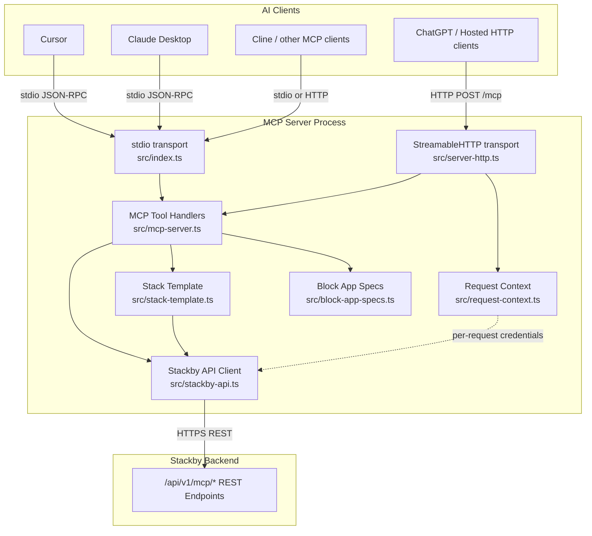

# Architecture

## Overview

The Stackby MCP Server is a Node.js/TypeScript application that exposes Stackby's spreadsheet/database platform to AI clients via the Model Context Protocol (MCP). It has two distinct transport entry points — stdio and StreamableHTTP — that share a single core: a registered set of 36 MCP tools backed by a common HTTP API client layer. The stdio entry point serves local AI clients such as Cursor and Claude Desktop; the HTTP entry point enables hosted access for clients like ChatGPT and any HTTP-capable MCP consumer. Both transports call the same tool handler logic and the same Stackby REST API client, so behavior is consistent across deployment modes.

---

## System Architecture



---

## Entry Points

| Entry Point | File | Transport | Supported Clients |
|---|---|---|---|
| stdio | `src/index.ts` | `StdioServerTransport` | Cursor, Claude Desktop, Cline |
| HTTP | `src/server-http.ts` | `StreamableHTTPServerTransport` | ChatGPT, any HTTP MCP client, hosted at `mcp.stackby.com` |

---

## Stateless HTTP Mode

Each POST to `/mcp` creates a brand-new `McpServer` instance and a fresh `StreamableHTTPServerTransport`, processes the request, and discards both objects when the response completes. No state — tool registrations, credentials, or in-flight data — is ever carried over from one request to the next. Concurrent requests therefore run in fully isolated server instances with no shared state. This design eliminates the "Already connected to a transport" error that arises when a single `McpServer` is reused and makes horizontal scaling straightforward.

---

## Source File Responsibilities

| File | Responsibility |
|---|---|
| `src/index.ts` | stdio entry point; creates a single `McpServer`, connects it to a `StdioServerTransport`, and keeps the process alive for the lifetime of the AI client session. |
| `src/server-http.ts` | HTTP entry point; runs a Node.js HTTP server that handles `/mcp`, `/health`, and OAuth proxy routes, creating a fresh `McpServer` and `StreamableHTTPServerTransport` for every incoming POST request. |
| `src/mcp-server.ts` | Core factory; registers all 36 MCP tools with their Zod input schemas and handler functions, and provides the `createStackbyMcpServer()` factory used by both entry points. |
| `src/stackby-api.ts` | Stackby HTTP API client; contains every function that calls a `/api/v1/mcp/*` endpoint, and handles credential resolution, auth header construction, and response envelope normalization. |
| `src/request-context.ts` | `AsyncLocalStorage`-based per-request context store; holds the API key, bearer token, and API base URL for the duration of a single HTTP request, providing isolation between concurrent requests. |
| `src/stack-template.ts` | Client-side stack template applicator; orchestrates the multi-step sequence of `createTable`, `createColumn`, and `createRow` API calls required to realize a declarative table/column/row template after stack creation. |
| `src/block-app-specs.ts` | Block type alias registry; maps user-supplied block type strings and their variants to canonical Stackby block type names, and provides the `getBlockAppSpec()` and `normalizeBlockAppType()` resolver functions. |

---

## Component Interaction Flow

The following sequence describes how a request moves through each layer from the AI client to the Stackby backend and back:

1. **AI Client** sends a JSON-RPC 2.0 `tools/call` message with a tool name and arguments object (keys may be `snake_case` or `camelCase`).
2. **MCP Transport** (either `StdioServerTransport` or `StreamableHTTPServerTransport`) decodes the JSON-RPC message and dispatches the call to the registered handler for that tool name in `mcp-server.ts`.
3. **`mcp-server.ts` handler** runs the `withCamel()` wrapper, which converts all `snake_case` input keys to `camelCase` (e.g. `stack_id` → `stackId`), then validates the normalized input against the tool's Zod schema.
4. **`stackby-api.ts` function** is called with the validated parameters. It resolves credentials via `authHeaders()` (reading from `AsyncLocalStorage` context in HTTP mode, or from `process.env` in stdio mode), constructs the target URL from the effective base URL, and issues an HTTPS request to the Stackby backend.
5. **Stackby backend** (`/api/v1/mcp/*`) processes the request and returns a JSON response, either a plain payload or a `{ data: T }` envelope.
6. **`normalizeResponse()`** in `stackby-api.ts` unwraps the envelope when present, delivering a consistent `{ data: T }` shape to the calling handler regardless of which endpoint was hit.
7. **`mcp-server.ts` handler** formats the typed result into a human-readable text string and returns `{ content: [{ type: "text", text }] }` to the transport. On error, it catches the thrown `Error`, sets `isError: true`, and returns the error message as the tool result.
8. **MCP Transport** encodes the result as a JSON-RPC 2.0 response and writes it to stdout (stdio) or the HTTP response stream (StreamableHTTP).
9. **AI Client** receives the formatted tool result.

---

## Build System

```bash
npm run build    # tsc → dist/
npm start        # node dist/index.js  (stdio)
npm run start:http  # node dist/server-http.js  (HTTP)
```

TypeScript is compiled with `tsc` (TypeScript ≥5.3, configured via `tsconfig.json`) and output goes to `dist/`. The project uses ESM modules (`"type": "module"` in `package.json`).

**Runtime dependencies:**

| Package | Purpose |
|---|---|
| `@modelcontextprotocol/sdk` | MCP protocol implementation — `McpServer`, `StdioServerTransport`, `StreamableHTTPServerTransport` |
| `zod` | Input schema definition and validation for all 36 tool handlers |

**Minimum Node.js version:** `>=18` (required for `AsyncLocalStorage` stability, `fetch` built-in, and ESM support).
