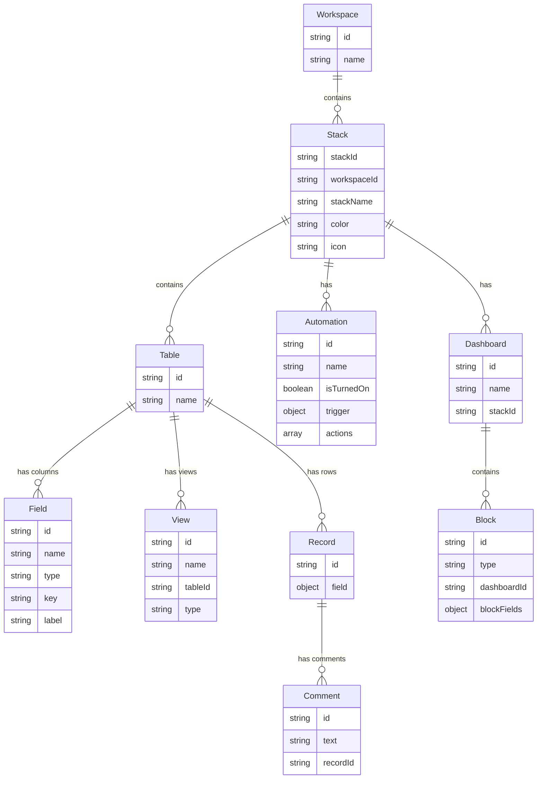

# Data Model

This document describes the Stackby entity hierarchy, the relationships between entities, and the data shapes used by the Stackby MCP Server when reading from and writing to the Stackby backend.

---

## Table of Contents

- [Overview](#overview)
- [Entity Hierarchy](#entity-hierarchy)
- [Entity Relationship Diagram](#entity-relationship-diagram)
- [Entity Descriptions](#entity-descriptions)
- [Stack Template Data Model](#stack-template-data-model)
- [Field Types Reference](#field-types-reference)

---

## Overview

Stackby organises data in a six-level hierarchy: **Workspaces** contain **Stacks**, Stacks contain **Tables**, and Tables contain **Fields** (column definitions), **Views** (display perspectives), and **Records** (rows). A Record can have one or more **Comments**. Each Stack can also own **Automations** (event-driven workflows) and **Dashboards**, and each Dashboard contains **Blocks** (visual widgets). All MCP tools read from and write to this hierarchy via the Stackby REST backend at `/api/v1/mcp/*`.

---

## Entity Hierarchy

```
Workspace
└── Stack (one or more per Workspace)
    ├── Table (one or more per Stack)
    │   ├── Field / Column (zero or more per Table)
    │   ├── View (zero or more per Table)
    │   └── Record / Row (zero or more per Table)
    │       └── Comment (zero or more per Record)
    ├── Automation (zero or more per Stack)
    └── Dashboard (zero or more per Stack)
        └── Block (zero or more per Dashboard)
```

---

## Entity Relationship Diagram



---

## Entity Descriptions

### Workspace

The top-level organisational container. Maps to a team or project space. A user can belong to multiple Workspaces. All Stacks live within a Workspace.

Key fields:

| Field | Type   | Description                          |
|-------|--------|--------------------------------------|
| `id`  | string | Unique workspace identifier          |
| `name`| string | Human-readable workspace display name|

MCP tool: [`list_workspaces`](tools/read-operations.md#list_workspaces)

---

### Stack

The equivalent of a spreadsheet workbook or relational database. A Stack contains Tables, Automations, and Dashboards. Identified by `stackId` throughout the API (not `id`).

Key fields:

| Field         | Type   | Description                             |
|---------------|--------|-----------------------------------------|
| `stackId`     | string | Unique stack identifier                 |
| `workspaceId` | string | Parent workspace                        |
| `stackName`   | string | Display name of the stack               |
| `color`       | string | Optional hex or named colour            |
| `icon`        | string | Optional icon identifier                |
| `createdAt`   | string | ISO 8601 creation timestamp (when present) |

MCP tools: [`list_stacks`](tools/read-operations.md#list_stacks), [`create_stack`](tools/stack-creation.md#create_stack)

---

### Table

A sheet or grid within a Stack. Tables hold Field definitions (columns), Views, and Records (rows). Identified by `id` within its parent Stack.

Key fields:

| Field  | Type   | Description                  |
|--------|--------|------------------------------|
| `id`   | string | Unique table identifier      |
| `name` | string | Display name of the table    |

MCP tools: [`list_tables`](tools/read-operations.md#list_tables), [`describe_table`](tools/read-operations.md#describe_table), [`create_table`](tools/schema-management.md#create_table), [`update_table`](tools/schema-management.md#update_table), [`delete_table`](tools/schema-management.md#delete_table)

---

### Field (Column)

A column definition in a Table. The `type` determines what values the field accepts and how the Stackby UI renders it. There are 39 canonical column types (see [Field Types Reference](#field-types-reference)). An optional `typeOptions` JSON blob stores type-specific configuration (date format, formula text, option list, etc.).

Key fields:

| Field    | Type   | Description                                                    |
|----------|--------|----------------------------------------------------------------|
| `id`     | string | Unique field identifier                                        |
| `name`   | string | Column header / display name                                   |
| `type`   | string | One of 39 canonical column type strings                        |
| `key`    | string | Internal key used for some API operations                      |
| `label`  | string | Optional alternative display label                             |

MCP tools: [`create_field`](tools/schema-management.md#create_field), [`update_field`](tools/schema-management.md#update_field), [`delete_field`](tools/schema-management.md#delete_field)

---

### View

A named, filtered, and/or sorted perspective on a Table. Views do not copy data — they define how the underlying records are displayed and filtered. Supported view types: `grid`, `kanban`, `gallery`, `calendar`, `form`.

Deleting a view is a **soft-delete**: the view becomes inaccessible via listing and retrieval, but the underlying records and field data are retained and can be recovered by admins.

Key fields:

| Field     | Type   | Description                                            |
|-----------|--------|--------------------------------------------------------|
| `id`      | string | Unique view identifier                                 |
| `name`    | string | Display name of the view                               |
| `tableId` | string | Parent table                                           |
| `type`    | string | One of: `grid`, `kanban`, `gallery`, `calendar`, `form`|

MCP tools: [`list_views`](tools/read-operations.md#list_views), [`create_view`](tools/view-management.md#create_view), [`rename_view`](tools/view-management.md#rename_view), [`delete_view`](tools/view-management.md#delete_view)

---

### Record (Row)

A single row in a Table. The `field` map contains all column values for this row, keyed by column name.

Key fields:

| Field   | Type   | Description                                                              |
|---------|--------|--------------------------------------------------------------------------|
| `id`    | string | Unique record identifier (format: `rw_...`)                              |
| `field` | object | Map of `columnName → value`; value type depends on the column's `type`   |

MCP tools: [`list_records`](tools/read-operations.md#list_records), [`get_record`](tools/read-operations.md#get_record), [`search_records`](tools/read-operations.md#search_records), [`create_record`](tools/write-operations.md#create_record), [`update_records`](tools/write-operations.md#update_records), [`delete_records`](tools/write-operations.md#delete_records)

---

### Automation

An event-driven or scheduled workflow within a Stack. Each Automation has exactly one **trigger** (which defines when it fires) and zero or more **action steps** (which define what it does when it fires).

Key fields:

| Field        | Type    | Description                                               |
|--------------|---------|-----------------------------------------------------------|
| `id`         | string  | Unique automation identifier                              |
| `name`       | string  | Human-readable name                                       |
| `description`| string  | Optional description                                      |
| `isTurnedOn` | boolean | Whether the automation is active                          |
| `tableId`    | string  | Optional associated table                                 |
| `viewId`     | string  | Optional associated view                                  |
| `trigger`    | object  | `{ triggerType, triggerParams, tableId, description }`    |
| `actions`    | array   | Array of `{ actionType, actionParams, sequence, description }` |

Trigger type codes: `T_CR_ROW`, `T_UP_ROW`, `SD_TIME`, `WH_RECV`, `RW_COND`, `VM_ROW`  
Action type codes: `CR_ROW`, `UP_ROW`, `FIND_ROW`, `S_EMAIL`, `WHATSAPP`, `GMAIL`, `OUTLOOK`, `MS_TEAM`, `SLACK`, `SORT`, `AI_GEN`

See the full catalog in [Automation Tools](tools/automation.md).

MCP tools: [`list_automations`](tools/read-operations.md#list_automations), [`get_automation`](tools/read-operations.md#get_automation), [`create_automation`](tools/automation.md#create_automation), [`update_automation`](tools/automation.md#update_automation), [`delete_automation`](tools/automation.md#delete_automation)

---

### Dashboard

A visual container within a Stack that holds Block widgets. Dashboards are managed via the `dashboard_action` passthrough tool.

Key fields:

| Field     | Type   | Description                   |
|-----------|--------|-------------------------------|
| `id`      | string | Unique dashboard identifier   |
| `name`    | string | Display name                  |
| `stackId` | string | Parent stack                  |

MCP tool: [`dashboard_action`](tools/dashboard-blocks.md#dashboard_action)

---

### Block

A widget placed on a Dashboard — for example a Chart, Summary metric, PivotTable, or Map. The block `type` is normalised via `block-app-specs.ts`, which resolves aliases case-insensitively to one of 18 canonical type strings. On creation, the MCP server transforms user-supplied fields into `blockFields` (JSON-stringified config), `gridLayout`, and `linearLayout` before calling the Stackby backend.

Key fields:

| Field          | Type   | Description                                                  |
|----------------|--------|--------------------------------------------------------------|
| `id`           | string | Unique block identifier                                      |
| `type`         | string | One of 18 canonical block type strings                       |
| `dashboardId`  | string | Parent dashboard                                             |
| `blockFields`  | object | JSON-stringified type-specific configuration                 |
| `gridLayout`   | object | JSON-stringified grid position/size `{ i, x, y, w, h, … }` |
| `linearLayout` | object | JSON-stringified linear (mobile) layout                     |

Supported types: `Chart`, `Summary`, `Description`, `GoalTracker`, `Embed`, `RowCard`, `PivotTable`, `CountDown`, `TimeTracker`, `Search`, `PageDesigner`, `StackSchema`, `Record Overview`, `Map`, `UrlPreview`, `Datafetcher`, `Batchupdate`, `vegalite`

MCP tool: [`block_action`](tools/dashboard-blocks.md#block_action)

---

### Comment

A text annotation attached to a specific Record in a Table.

Key fields:

| Field      | Type   | Description                                    |
|------------|--------|------------------------------------------------|
| `id`       | string | Unique comment identifier                      |
| `text`     | string | Comment body (max 2000 characters)             |
| `recordId` | string | Parent record                                  |
| `tableId`  | string | Parent table                                   |
| `attachment`| unknown | Optional file attachment                      |
| `cellValue`| unknown | Optional cell value context                   |

MCP tool: [`create_record_comment`](tools/write-operations.md#create_record_comment)

---

## Stack Template Data Model

The `create_stack` tool accepts an optional `tables` array — a declarative **Stack Template** — that defines tables, columns, and seed rows to be created along with the new Stack. The template is applied either server-side (if the backend supports it) or client-side via `stack-template.ts` (see [Stack Creation](tools/stack-creation.md) for the full two-path flow).

### TemplateTableInput

Defines a single table in the template.

```typescript
interface TemplateTableInput {
  key?:     string;                  // Stable identifier for cross-referencing in linkToTableKey
  name?:    string;                  // Display name (required for 2nd+ tables)
  columns?: TemplateColumnInput[];   // Column definitions (see below)
  rows?:    TemplateRowInput[];      // Seed rows (see below)
}
```

- `key` — a stable, unique string used to reference this table from `linkToTableKey` in column definitions. Distinct from the display `name`; cross-references remain valid even if the display name changes.
- `name` — the first table in the template maps to the stack's existing default table (so `name` is optional for index 0); all subsequent tables require a name.

### TemplateColumnInput

Defines a single column within a `TemplateTableInput`.

```typescript
interface TemplateColumnInput {
  name:              string;   // Column display name (required)
  columnType:        string;   // Canonical type or alias (required)
  options?:          string[]; // For singleOption / multipleOptions columns
  linkToTableKey?:   string;   // Table key of the linked table (required for type "link")
  formulaText?:      string;   // Formula expression (required for formula / aggregation)
  linkToTableViewId?: string;  // Optional view ID on the linked table for link columns
  linkColumnName?:   string;   // Name of an existing link column on this table (for lookup/rollup)
  linkColumnId?:     string;   // Explicit link column ID on this table (for lookup/rollup)
  linkedColumnName?: string;   // Column name on the linked table to pull data from (for lookup/aggregation)
  linkedColumnId?:   string;   // Explicit column ID on the linked table (for lookup/aggregation)
}
```

Columns are created in four phases to satisfy dependencies:

| Phase | Column types | Reason |
|-------|-------------|--------|
| 1 — Base | All types except `link`, `formula`, `lookup`, `lookupCount`, `aggregation` | No dependencies |
| 2 — Link | `link` | Foreign table IDs must exist first |
| 3 — Formula | `formula` | Can reference base and link columns |
| 4 — Rollup | `lookup`, `lookupCount`, `aggregation` | Require a link column ID to already exist |

### TemplateRowInput

Defines a single seed row within a `TemplateTableInput`.

```typescript
interface TemplateRowInput {
  rowKey?: string;                    // Stable key for cross-referencing from other rows
  fields:  Record<string, unknown>;   // Column name → value
}
```

**Linked-record field values** use a special shape to reference rows by `rowKey` rather than API-assigned row IDs:

```jsonc
// Single linked row
{ "__linkRowKey": "company-acme" }

// Multiple linked rows
{ "__linkRowKeys": ["company-acme", "company-globex"] }
```

The `rowKey` → row ID mapping is resolved during template application after each row is created. If a referenced `rowKey` is not found, the server adds a warning to the result and skips the link.

**Example template:**

```json
{
  "tables": [
    {
      "key": "companies",
      "name": "Companies",
      "columns": [
        { "name": "Name",    "columnType": "shortText" },
        { "name": "Industry","columnType": "singleOption", "options": ["Tech","Finance","Retail"] }
      ],
      "rows": [
        { "rowKey": "acme",   "fields": { "Name": "Acme Corp",   "Industry": "Tech"    } },
        { "rowKey": "globex", "fields": { "Name": "Globex Corp", "Industry": "Finance" } }
      ]
    },
    {
      "key": "tasks",
      "name": "Tasks",
      "columns": [
        { "name": "Task",    "columnType": "shortText" },
        { "name": "Company", "columnType": "link", "linkToTableKey": "companies" },
        { "name": "# Companies", "columnType": "lookupCount", "linkColumnName": "Company", "linkToTableKey": "companies" }
      ],
      "rows": [
        {
          "fields": {
            "Task": "Kickoff meeting",
            "Company": { "__linkRowKeys": ["acme", "globex"] }
          }
        }
      ]
    }
  ]
}
```

---

## Field Types Reference

The 39 canonical column types supported by the Stackby API. All types are accepted as input by `columnType` fields in the MCP tools. Many types also accept common aliases (e.g. `"text"` → `shortText`); see [Input Validation — Column Type Normalization](input-validation.md#column-type-normalization) for the full alias map.

### Text

| Canonical Type | Description                          | Common Aliases                    |
|----------------|--------------------------------------|-----------------------------------|
| `shortText`    | Single-line text                     | `text`, `short text`              |
| `longText`     | Multi-line / rich text               | `long text`, `multiline text`     |
| `email`        | Email address                        | —                                 |
| `url`          | URL / web address                    | —                                 |
| `phoneNumber`  | Phone number with optional country code | `phone number`                 |

### Number

| Canonical Type | Description                          | Common Aliases |
|----------------|--------------------------------------|----------------|
| `number`       | Numeric value (decimal, integer, currency, percent) | — |
| `rating`       | Star rating (integer scale)          | —              |
| `duration`     | Time duration (`h:mm` format)        | —              |

### Date / Time

| Canonical Type  | Description                        | Common Aliases              |
|-----------------|------------------------------------|-----------------------------|
| `dateAndTime`   | Date with optional time component  | `date`, `date field`        |
| `createdTime`   | Auto-populated record creation timestamp | `created time`        |
| `updatedTime`   | Auto-updated last-modified timestamp | `updated time`            |
| `time`          | Time-of-day field                  | —                           |

### Selection

| Canonical Type    | Description                         | Common Aliases                                      |
|-------------------|-------------------------------------|-----------------------------------------------------|
| `singleOption`    | Single-select dropdown              | `dropdown`, `select`, `singleselect`, `single-select` |
| `multipleOptions` | Multi-select dropdown               | `multiselect`, `multi-select`, `multi_select`       |

### Boolean

| Canonical Type | Description      | Common Aliases |
|----------------|------------------|----------------|
| `checkbox`     | True/false toggle| —              |

### Link / Reference

| Canonical Type | Description                                                  | Common Aliases         |
|----------------|--------------------------------------------------------------|------------------------|
| `link`         | Linked record — references rows in another table             | —                      |
| `lookup`       | Pulls a field value from a linked record                     | —                      |
| `lookupCount`  | Counts linked records                                        | `lookup count`, `count`|
| `aggregation`  | Rolls up values from linked records (SUM, MAX, etc.)         | `rollup`, `roll up`    |

### Formula

| Canonical Type | Description                                   | Common Aliases |
|----------------|-----------------------------------------------|----------------|
| `formula`      | Computed value based on a formula expression  | —              |

Valid aggregation formula strings (used with `columnType: "aggregation"`):

`MIN(values)` · `MAX(values)` · `SUM(values)` · `AVERAGE(values)` · `COUNT(values)` · `COUNTA(values)` · `COUNTALL(values)` · `AND(values)` · `OR(values)` · `XOR(values)` · `ARRAYJOIN(values)` · `ARRAYUNIQUE(values)` · `ARRAYCOMPACT(values)` · `ARRAYFLATTEN(values)`

### Media

| Canonical Type       | Description                       | Common Aliases                      |
|----------------------|-----------------------------------|-------------------------------------|
| `multipleAttachment` | File attachments                  | `multiple attachment`, `attachment` |
| `signature`          | Handwritten signature field       | —                                   |
| `barcode`            | Barcode scanner input             | —                                   |

### People / Audit

| Canonical Type         | Description                            | Common Aliases         |
|------------------------|----------------------------------------|------------------------|
| `singleCollaborator`   | Single user selector                   | —                      |
| `multipleCollaborator` | Multi-user selector                    | —                      |
| `createdBy`            | Auto-populated record creator          | `created by`           |
| `updatedBy`            | Auto-populated last editor             | `updated by`           |

### Special / Advanced

| Canonical Type         | Description                                              | Common Aliases    |
|------------------------|----------------------------------------------------------|-------------------|
| `autoNumber`           | Auto-incrementing integer ID                             | `auto number`     |
| `checkList`            | Checklist / task list within a cell                      | —                 |
| `location`             | Geographic location field                                | —                 |
| `button`               | Clickable button that triggers an action                 | —                 |
| `ai`                   | AI-generated content field                               | —                 |
| `apiPush`              | Receives data pushed from an external API                | —                 |
| `api`                  | Generic API-backed field                                 | —                 |
| `apiData`              | API data field                                           | —                 |
| `apiDataJson`          | API data — JSON format                                   | —                 |
| `apiDataText`          | API data — plain text                                    | —                 |
| `apiDataMultilineText` | API data — multi-line text                               | —                 |
| `apiDataPhone`         | API data — phone format                                  | —                 |
| `apiDataNumber`        | API data — number format                                 | —                 |
| `apiDataDate`          | API data — date format                                   | —                 |
| `apiDataDuration`      | API data — duration format                               | —                 |

> **Note:** `rollup` is a common alias for `aggregation` and is accepted as input to `columnType`. It is not a separate canonical type.

---

## Related Documentation

- [Architecture](architecture.md) — system components and how they interact
- [API Reference](api-reference.md) — every `/api/v1/mcp/*` backend endpoint
- [Input Validation](input-validation.md) — column type normalization, alias map, parsing rules
- [Tools — Schema Management](tools/schema-management.md) — `create_field`, `update_field`, `delete_field`
- [Tools — Stack Creation](tools/stack-creation.md) — `create_stack` and the full template application flow
- [Tools — Dashboard & Blocks](tools/dashboard-blocks.md) — `dashboard_action`, `block_action`
