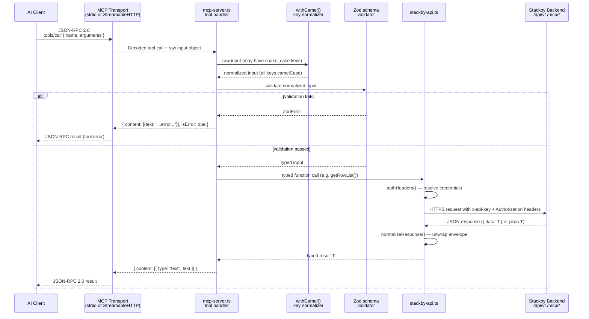

# Request Lifecycle

This document traces the complete journey of a single tool call — from the AI client's JSON-RPC message to the Stackby backend and back — and explains every transformation and decision point along the way.

**Covers:** Requirements 12.1, 12.2, 12.3, 12.4, 12.5, 12.6, 12.7

---

## Overview

When an AI client (Cursor, Claude Desktop, ChatGPT, etc.) invokes an MCP tool such as `list_records`, the call travels through five distinct layers before a response is returned. The transport layer decodes the wire message and routes it to the correct handler in `mcp-server.ts`. That handler normalizes the input keys to camelCase, validates them with a Zod schema, and delegates to a function in `stackby-api.ts`. The API client resolves the caller's credentials, constructs the HTTPS request to the Stackby backend, unwraps the response envelope, and returns a typed result. The handler then formats the result as human-readable text and sends it back through the transport. Errors at any stage propagate upward through a consistent `isError: true` pattern rather than as protocol-level failures.

---

## End-to-End Flow



---

## Step-by-Step Walkthrough

The following steps use `list_records` with the input `{ "stack_id": "st_abc", "table_id": "tb_xyz" }` as a concrete example.

1. **AI Client sends a JSON-RPC `tools/call`**

   The client sends a message over the active transport (stdio pipe or HTTP POST to `/mcp`):

   ```json
   {
     "jsonrpc": "2.0",
     "method": "tools/call",
     "params": {
       "name": "list_records",
       "arguments": {
         "stack_id": "st_abc",
         "table_id": "tb_xyz",
         "max_records": 50
       }
     },
     "id": 1
   }
   ```

   Arguments may use `snake_case`, `camelCase`, or a mix — both conventions are accepted.

2. **MCP Transport decodes and dispatches**

   The `@modelcontextprotocol/sdk` transport layer parses the JSON-RPC envelope, looks up the registered handler for `list_records`, and calls it with the raw `arguments` object.

3. **`withCamel()` wrapper runs — key normalization**

   Before the real handler logic executes, `withCamel()` passes the raw input to `camelCaseKeys()`, which converts every **top-level** key from `snake_case` to `camelCase`:

   ```
   stack_id    → stackId
   table_id    → tableId
   max_records → maxRecords
   ```

   Keys already in camelCase pass through unchanged. This is a surface-level transformation — only top-level keys are affected, not nested objects.

4. **Zod schema validates the normalized input**

   The handler's registered `inputSchema` (a Zod object schema) validates the normalized input. If a required field is missing, has the wrong type, or fails a constraint (e.g. `min(1)` on an array), Zod produces an error and the handler returns immediately:

   ```json
   { "content": [{ "type": "text", "text": "stackId and tableId are required." }], "isError": true }
   ```

   No API call is made on validation failure.

5. **Handler calls the appropriate `stackby-api.ts` function**

   With a valid, typed input the handler calls the relevant API function, passing the extracted parameters:

   ```typescript
   const records = await getRowList(stackId, tableId, { maxRecords: 50 });
   ```

6. **`authHeaders()` resolves credentials**

   Inside `getRowList()` → `request<T>()`, the `authHeaders()` function is called. It resolves credentials using this priority:

   - **HTTP mode**: reads from `AsyncLocalStorage` (populated from `X-Stackby-API-Key` / `Authorization: Bearer` request headers)
   - **stdio mode**: reads from `process.env.STACKBY_BEARER_TOKEN` or `process.env.STACKBY_API_KEY`

   Bearer token is checked first; API key second. If neither is available, `authHeaders()` throws synchronously — the error is caught by `request<T>()` and propagated to the handler.

7. **`request<T>()` builds the URL and sends the HTTPS request**

   `request<T>()` constructs the full URL by combining the resolved base URL with the endpoint path, merges the auth headers with any extra per-call headers, and dispatches the request using the global `fetch`:

   ```
   GET https://stackby.com/api/v1/mcp/stacks/st_abc/tables/tb_xyz/rows?maxrecord=50&offset=0
   Headers: { x-api-key: "...", Authorization: "Bearer ...", Content-Type: "application/json" }
   ```

8. **Stackby backend returns JSON**

   The backend responds with either:
   - An envelope: `{ "data": [...] }` — common for list endpoints
   - A plain payload: `[...]` or `{ ... }` — used by some endpoints that return the result directly

9. **`normalizeResponse()` unwraps the envelope**

   The raw response body is passed to `normalizeResponse<T>()`:

   ```typescript
   function normalizeResponse<T>(body: unknown): { data: T } {
     if (body != null && typeof body === "object" && "data" in body && body.data !== undefined) {
       return { data: body.data as T };
     }
     return { data: body as T };
   }
   ```

   Both response shapes produce a consistent `{ data: T }` result that all callers can read from `.data`.

10. **Handler formats the result and returns**

    Back in `mcp-server.ts`, the handler receives the typed result array, formats it as a human-readable text string, and returns:

    ```typescript
    return {
      content: [{ type: "text", text: "Records in table tb_xyz (3):\n- id: rw_1 | {...}\n..." }],
    };
    ```

11. **On error: `isError: true` response**

    If any step from 5 onward throws, the try/catch in the handler intercepts it and returns an error result (see [Error Propagation Chain](#error-propagation-chain)).

---

## `camelCaseKeys()` and `withCamel()`

**Source:** `src/mcp-server.ts`

```typescript
function camelCaseKeys<T extends Record<string, any>>(obj: T): T {
  const out: any = {};
  for (const key of Object.keys(obj || {})) {
    const camel = key.replace(/_([a-z])/g, (_, ch) => ch.toUpperCase());
    out[camel] = obj[key];
  }
  return out;
}

function withCamel<R>(
  handler: (input: Record<string, any>) => Promise<R>
): (input: any) => Promise<R> {
  return async (originalInput: any) => {
    const input = camelCaseKeys<Record<string, any>>(originalInput || {});
    return handler(input);
  };
}
```

Key behaviors:

- **Scope:** Only top-level keys are converted. Values that are themselves objects (like the `trigger` object in `create_automation`) are passed through as-is with their original key casing.
- **Idempotent:** Running `camelCaseKeys` on already-camelCase keys produces identical output — `stackId` stays `stackId`.
- **Convention-agnostic:** AI clients can send `stack_id` or `stackId` interchangeably. This is important because different LLMs prefer different conventions when generating tool inputs.
- **Applied via `withCamel`:** Every tool handler is wrapped with `withCamel()` at registration time, so normalization is guaranteed before any handler logic runs.

Transformation examples:

| Input key      | Output key    |
|----------------|---------------|
| `stack_id`     | `stackId`     |
| `table_id`     | `tableId`     |
| `record_ids`   | `recordIds`   |
| `column_type`  | `columnType`  |
| `max_records`  | `maxRecords`  |
| `stackId`      | `stackId`     |
| `workspaceId`  | `workspaceId` |

---

## `normalizeResponse()`

**Source:** `src/stackby-api.ts`

```typescript
function normalizeResponse<T>(body: unknown): { data: T } {
  if (body != null && typeof body === "object" && "data" in body && (body as { data?: unknown }).data !== undefined) {
    return { data: (body as { data: T }).data };
  }
  return { data: body as T };
}
```

The Stackby backend uses two response shapes depending on the endpoint:

| Shape | Example | When used |
|---|---|---|
| Envelope | `{ "data": [...] }` | Most list and mutation endpoints |
| Plain | `[...]` or `{ ... }` | Some endpoints return raw arrays or objects |

`normalizeResponse()` unifies these two shapes:

- **Envelope detected** (`body.data !== undefined`): extracts `body.data` and returns `{ data: body.data }`.
- **Plain payload** (`body.data === undefined` or not an object): wraps the entire body and returns `{ data: body }`.

All callers in `stackby-api.ts` receive a consistent `{ data: T }` shape and read from `.data`, regardless of which format the backend returned.

---

## `authHeaders()`

**Source:** `src/stackby-api.ts`

```typescript
function authHeaders(): HeadersInit {
  const bearerToken = getEffectiveBearerToken();
  if (bearerToken) {
    return {
      "Content-Type": "application/json",
      Authorization: `Bearer ${bearerToken}`,
    };
  }

  const key = getEffectiveApiKey();
  if (!key) {
    throw new Error("No auth credential set. Provide STACKBY_API_KEY or STACKBY_BEARER_TOKEN ...");
  }
  return {
    "Content-Type": "application/json",
    "x-api-key": key,
    Authorization: `Bearer ${key}`,
  };
}
```

Key behaviors:

- **Credential priority:** Bearer token is checked first. If a bearer token is present it is used exclusively and the API key is not consulted.
- **When using an API key:** both `x-api-key` and `Authorization: Bearer` headers are set to the same API key value — this satisfies Stackby's `devapi` authentication mode which checks both headers.
- **Lazy throw:** `authHeaders()` does not run at server startup. It is called inside `request<T>()` at the moment an HTTP request is being constructed. If no credential is available, the `Error` is thrown there and propagates to the tool handler's try/catch.
- **Credential resolution order** (for `getEffectiveApiKey()` / `getEffectiveBearerToken()`):
  1. Per-request `AsyncLocalStorage` context (HTTP mode — populated from `X-Stackby-API-Key` or `Authorization: Bearer` headers)
  2. `process.env.STACKBY_API_KEY` / `process.env.STACKBY_BEARER_TOKEN` (stdio mode and HTTP fallback)

---

## `request<T>()`

**Source:** `src/stackby-api.ts`

```typescript
async function request<T>(path: string, options: RequestInit = {}): Promise<{ data: T }> {
  const base = getEffectiveBaseUrl();
  const url = path.startsWith("http") ? path : `${base}${path.startsWith("/") ? path : `/${path}`}`;
  const res = await fetch(url, {
    ...options,
    headers: { ...authHeaders(), ...(options.headers as Record<string, string>) },
  });
  const body = await res.json().catch(() => ({}));
  if (!res.ok) {
    const msg = body?.error ?? body?.message ?? res.statusText;
    console.error("[Stackby MCP API] Request failed", { ... });
    throw new Error(`Stackby API ${res.status}: ${msg}`);
  }
  return normalizeResponse<T>(body);
}
```

What each step does:

1. **URL construction:** If `path` is an absolute URL it is used as-is. Otherwise the resolved base URL is prepended, ensuring a single `/` between base and path. The default base is `https://stackby.com` (overridable via `STACKBY_API_URL` or the `X-Stackby-API-URL` request header).

2. **Header merging:** `authHeaders()` is called to get the auth headers. Any extra headers passed in `options.headers` are merged on top, allowing per-call overrides.

3. **Fetch:** The standard global `fetch` is used. `options` passes through the `method` (`GET`, `POST`, `PATCH`, `DELETE`) and any `body` payload.

4. **Response parsing:** `res.json()` is called with a `.catch(() => ({}))` fallback — if the body is not valid JSON (e.g. an empty 204 response), an empty object is used so downstream code does not crash.

5. **Error handling:** On any non-2xx status code, `request<T>()` logs the failure to `stderr` (with method, URL, status, auth mode, and response body) and throws a structured error:

   ```
   Error: Stackby API 403: Insufficient permissions
   ```

6. **Success:** On 2xx, the parsed body is passed to `normalizeResponse<T>()` and returned.

---

## Error Propagation Chain

Errors flow upward through a consistent chain and always reach the AI client as readable tool output, never as a JSON-RPC protocol-level error.

```
Stackby backend returns HTTP 4xx or 5xx
  │
  ▼
stackby-api.ts request<T>()
  throws Error("Stackby API {status}: {message}")
  (also logs full detail to stderr)
  │
  ▼
mcp-server.ts tool handler try/catch
  catches the Error
  returns {
    content: [{ type: "text", text: "Failed to list records: Stackby API 403: Insufficient permissions. Check stackId, tableId, and API access." }],
    isError: true
  }
  │
  ▼
MCP Transport
  encodes as a JSON-RPC 2.0 tool result (not a protocol error)
  │
  ▼
AI Client
  receives the error text as normal tool output
  isError: true signals the client to surface it as a tool failure
```

Important properties of this design:

- The JSON-RPC connection is **never broken** by a Stackby API error. Only unhandled exceptions in the transport layer itself produce protocol errors.
- The `stderr` log written by `request<T>()` includes `authMode`, `responseError`, and `responseBody`, giving operators detailed diagnostics without exposing them to end users.
- The error message the AI client sees always starts with `"Failed to {verb} {noun}:"` followed by the API error, making the failure actionable.

---

## Two-Step API Pattern (`create_field`)

**Source:** `src/mcp-server.ts` — `create_field` handler  
**Related API function:** `stackby-api.ts` `getTableViewList()`, `createColumn()`

The Stackby column create endpoint requires a `viewId` to determine where the column should be placed in the view's column order. Because users often do not know their view IDs, `create_field` automatically resolves one through a two-step call sequence.

### Standard path (no `viewId` provided)

```
Step 1: GET /api/v1/mcp/stacks/:stackId/tables/:tableId/views
        → returns array of views; takes views[0].id as viewIdToUse

Step 2: POST /api/v1/mcp/columns
        body: { stackId, tableId, name, columnType, viewId: viewIdToUse, ... }
        → returns the created column
```

### Link column path (type = `link`, no `linkToTableViewId` provided)

For `link` columns, Stackby also requires a view ID from the **target** table. A third API call is inserted:

```
Step 1: GET /api/v1/mcp/stacks/:stackId/tables/:tableId/views
        → resolves viewIdToUse for the current table

Step 2: GET /api/v1/mcp/stacks/:stackId/tables/:linkToTableId/views
        → resolves linkToViewId for the target (linked) table

Step 3: POST /api/v1/mcp/columns
        body: { ..., viewId: viewIdToUse, linkToTableId, linkToTableViewId: linkToViewId }
```

### Error handling

If step 1 returns an empty array — meaning the table has no views — the handler still proceeds with `viewId: ""`. The Stackby backend may reject this with a 4xx error, which propagates through the standard [Error Propagation Chain](#error-propagation-chain).

### Why this is necessary

The column create endpoint (`POST /api/v1/mcp/columns`) was designed for the Stackby UI where a view is always in context. The MCP server bridges this gap by fetching the first available view ID automatically, so callers only need to provide the column definition itself.
